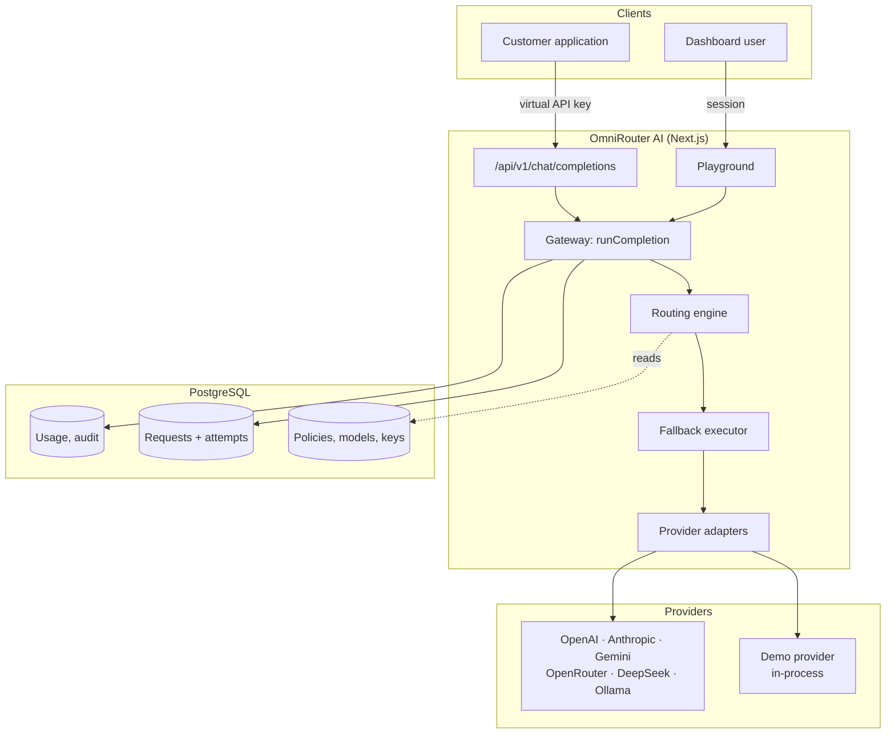
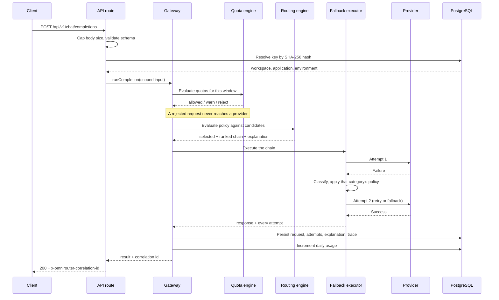
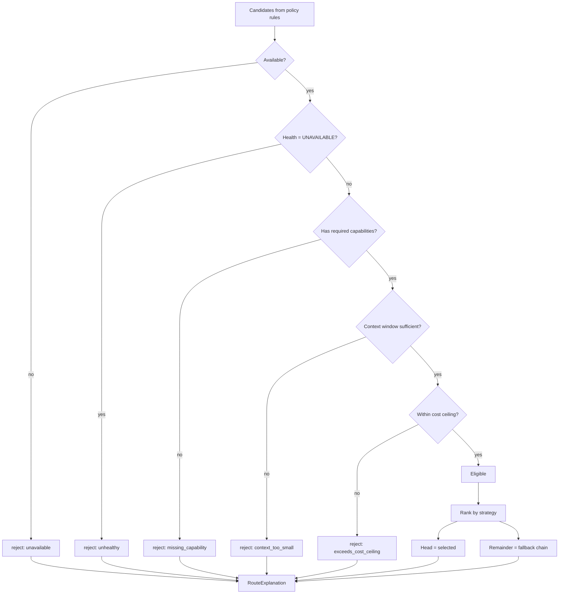
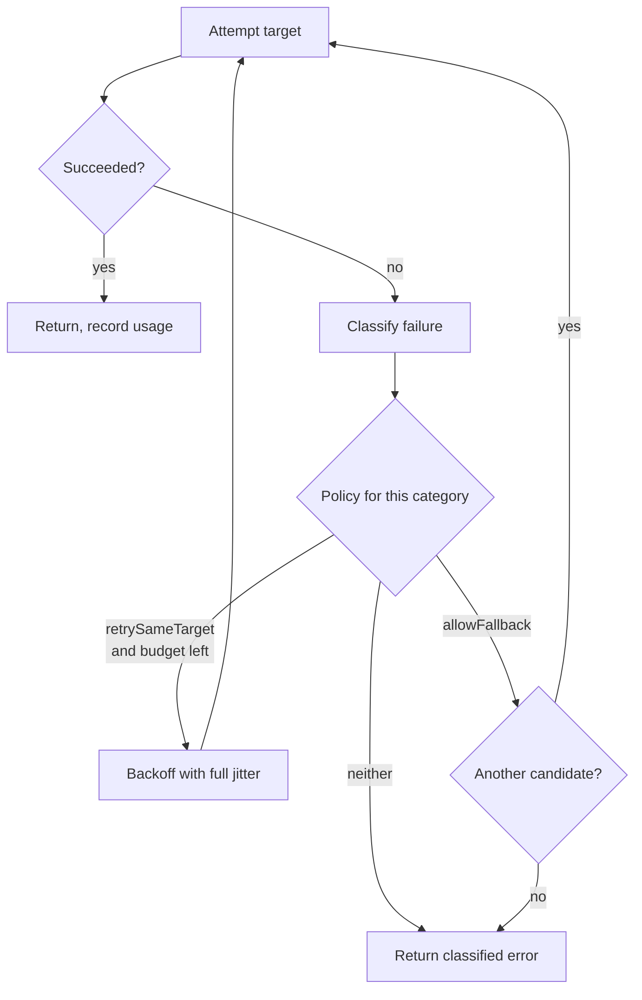
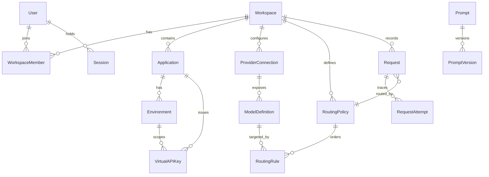
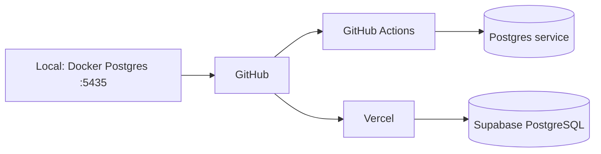

# Architecture

**Project:** OmniRouter AI
**Author:** Arslan Vuzmal Lone

---

## The thesis

Most AI gateways log _which_ model handled a request. OmniRouter persists _why_ — as structured, queryable data attached to the request, including the candidates that were rejected and the reason each one was dropped.

That single decision drives the schema, the API and the interface. A routing decision made last month remains explainable after the policy that produced it has been edited, because the explanation is a stored artefact rather than a runtime log line.

---

## System shape

**One execution path.** The public API, the playground and Client Story Mode all call the same `runCompletion`. A demonstration is therefore evidence about production behaviour rather than a parallel mock that can silently drift.

---

## Request lifecycle

Steps in order:

1. **Bound** — body size capped before parsing; schema limits message count and total length.
2. **Authenticate** — the presented key is hashed and matched. Workspace, application and environment come from the key, never from the body.
3. **Authorise** — scope and expiry checked before any work.
4. **Meter** — quotas counted for the current window.
5. **Route** — candidates filtered on capability, context and cost, then ranked by strategy.
6. **Execute** — the ranked chain walked; each failure classified before reacting.
7. **Normalise** — provider response mapped into the platform envelope.
8. **Record** — request, attempts, explanation, trace stages and usage persisted.

---

## Routing

Filtering is shared by every strategy, so eligibility rules live in one place and no candidate is ever silently dropped. The ordered remainder _is_ the fallback chain — fallback is the same ranking minus the head, not a separate mechanism.

`evaluateRoute` is pure and synchronous: all live signals (health, latency, success rate) are resolved by the caller and passed in, which is what makes all eight strategies unit-testable without a database.

**A degraded provider is deprioritised, not removed.** Only `UNAVAILABLE` filters a candidate out. Health is a decaying signal, not a boolean.

---

## Fallback

Bounded by **both** `maxAttempts` and `totalTimeoutMs`. Every path either consumes an attempt or exits, so no input can produce an unbounded loop.

| Category               | Retry same | Fallback | Reasoning                                            |
| ---------------------- | ---------- | -------- | ---------------------------------------------------- |
| `AUTHENTICATION`       | no         | yes      | Credentials do not become valid by repetition        |
| `PERMISSION`           | no         | yes      | Retrying cannot grant access                         |
| `RATE_LIMIT`           | 1×         | yes      | Transient; backed-off retry then move on             |
| `TIMEOUT`              | 1×         | yes      | A second retry risks duplicating in-flight work      |
| `PROVIDER_UNAVAILABLE` | no         | yes      | Waiting will not help                                |
| `INVALID_REQUEST`      | no         | **no**   | Fails identically everywhere                         |
| `CONTEXT_LIMIT`        | no         | yes      | Only to a larger window; never truncate silently     |
| `SAFETY_REFUSAL`       | no         | **no**   | Not shopped until a provider complies                |
| `MALFORMED_RESPONSE`   | 1×         | yes      | May parse on retry                                   |
| `NETWORK`              | 1×         | yes      | Transient                                            |
| `QUOTA_EXCEEDED`       | no         | **no**   | A deliberate rejection, not a provider fault         |
| `UNKNOWN`              | no         | yes      | One fallback; never repeat an unrecognised condition |

Backoff uses **full jitter** (`random() × ceiling`) so concurrent requests do not synchronise into a retry storm.

---

## Data model

21 entities. Design commitments:

- **Every tenant-scoped table carries `workspaceId`**, so isolation is one indexed predicate rather than a join chain.
- **`Request` → `RequestAttempt`** is the trace. Storing attempts separately is what makes a retry inspectable after the fact.
- **JSONB only where shape must vary** — `routeExplanation`, `traceStages`, policy `requirements` and `scoring`. Everything else is relational and constrained.
- **`UsageDaily` aggregates at the environment grain.** A compound unique containing a nullable column constrains nothing in PostgreSQL, because NULLs compare as distinct — two "no model" rows for the same day would both insert. Per-model analytics derives from `RequestAttempt`, which carries the model on every row.
- **`AuditLog` is append-only by construction.** No update or delete helper exists in the application layer.

---

## Security posture

| Concern              | Approach                                                                                                               |
| -------------------- | ---------------------------------------------------------------------------------------------------------------------- |
| Passwords            | scrypt (`N=16384, r=8, p=1`), per-password salt, parameters embedded so cost can be raised later                       |
| Sessions             | Opaque token in an `httpOnly` cookie; database stores only its SHA-256. Revocable server-side; never in `localStorage` |
| Virtual API keys     | SHA-256 only. Plaintext shown once; the stored prefix cannot authenticate                                              |
| Provider credentials | AES-256-GCM with a random 12-byte IV per encryption. Authenticated: tampering fails to decrypt                         |
| Tenant isolation     | Every query scoped by `workspaceId`. A foreign record is indistinguishable from a missing one                          |
| Authorisation        | Server-side RBAC before every mutation. Hidden buttons are presentation, not access control                            |
| Error messages       | Provider text never forwarded — it can echo prompt content or internal endpoints                                       |
| Content retention    | `METADATA_ONLY` by default; full content requires an explicit workspace opt-in                                         |
| Audit records        | Sensitive keys replaced with `[redacted]` before a snapshot is written                                                 |

Full analysis: [`THREAT_MODEL.md`](THREAT_MODEL.md), [`SECURITY_MODEL.md`](SECURITY_MODEL.md), [`PRIVACY_MODEL.md`](PRIVACY_MODEL.md).

---

## Deployment

`DATABASE_URL` is the pooled connection used at runtime; `DIRECT_URL` is unpooled and used by Prisma Migrate, because Supabase's pooler cannot run DDL. Every dashboard route is `force-dynamic` — it reads live workspace data and cannot be prerendered.

---

## Stack, and why

| Choice                  | Reason                                                                                                                    |
| ----------------------- | ------------------------------------------------------------------------------------------------------------------------- |
| Next.js 16 App Router   | Server Components suit a data-heavy dashboard; route groups segment layouts without polluting URLs                        |
| TypeScript **6.0.3**    | Not 7.0.2 (`latest`): `typescript-eslint` declares `<6.1.0`, so TS 7 would disable linting entirely                       |
| ESLint **9.x**          | Not 10.x: `eslint-plugin-react`, pulled in by `eslint-config-next`, calls `context.getFilename()` which ESLint 10 removed |
| Prisma 7 + `pg` adapter | Prisma 7 moves connection URLs to `prisma.config.ts` and connects through a driver adapter rather than the Rust engine    |
| scrypt over argon2      | Ships in the Node standard library — no native compilation in CI or on Vercel's build image                               |
| Tailwind 4              | Token-driven design system in CSS, no config file indirection                                                             |

Recorded in [`DECISIONS.md`](DECISIONS.md).
