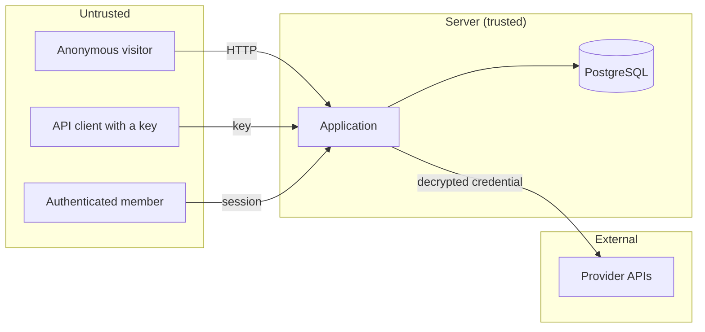

# Threat model

**Project:** OmniRouter AI
**Author:** Arslan Vuzmal Lone

---

## Assets

Ranked by consequence of disclosure.

| Asset                       | Why it matters                                                   |
| --------------------------- | ---------------------------------------------------------------- |
| Provider API credentials    | Direct financial loss and reputational exposure for the customer |
| Virtual API keys            | Grants gateway access; spends the customer's provider quota      |
| Session tokens              | Full account takeover within a workspace                         |
| Prompt and response content | May contain the customer's own users' personal data              |
| Request metadata            | Reveals traffic volume, cost profile and provider mix            |
| Audit records               | Evidence; must be trustworthy to have any value                  |

---

## Trust boundaries

**Everything left of the server boundary is untrusted**, including an authenticated member: a valid session establishes _who_ someone is, not _what_ they may do.

---

## Threats and mitigations

### T1 — Cross-tenant data access

_A member of workspace A reads workspace B's requests by guessing or editing an id._

Every tenant-scoped query carries `workspaceId` beside the record id. A foreign record returns `null`, indistinguishable from a missing one — revealing that a record exists but is inaccessible would confirm the presence of other tenants.

**Residual:** a query written without the predicate would bypass this. Mitigated by a security test asserting the property, not by convention alone.

---

### T2 — Privilege escalation

_A developer or admin grants themselves greater access._

Permissions are checked server-side before every mutation. Role assignment is rank-limited: a member may only assign a role strictly below their own, so an admin cannot mint another owner or promote themselves. Only an owner may transfer ownership or delete the workspace.

---

### T3 — Credential exfiltration

_An attacker with database read access recovers provider credentials._

Credentials are AES-256-GCM ciphertext; the key lives in the environment, not the database. A database dump alone is insufficient. Credentials are never returned to a browser, logged, or written into an audit record — audit snapshots pass through a redactor that replaces sensitive keys.

**Residual:** an attacker with **both** database access and `ENCRYPTION_KEY` recovers everything. A production deployment should hold the key in a managed KMS.

---

### T4 — API key theft or misuse

_A leaked key is used by a third party._

Keys are stored as SHA-256, so a database disclosure yields nothing usable. Each key is scoped to one application and one environment, bounding the blast radius. Revocation is immediate and checked on every request. `lastUsedAt` supports detecting unexpected activity.

**Residual:** a key leaked from the _customer's_ systems is valid until revoked. Expiry and rotation are supported; automated anomaly detection is not implemented.

---

### T5 — Key enumeration

_An attacker probes which keys exist._

An unknown key and a malformed key return byte-identical rejections. Revoked and expired keys return a distinct message deliberately — the caller already possesses that key, so no information is disclosed, and vagueness there costs a legitimate integrator hours.

---

### T6 — Session hijacking

_An attacker steals or forges a session._

Tokens are 32 bytes of CSPRNG output in an `httpOnly`, `sameSite=lax`, `secure` cookie, stored server-side as SHA-256. Nothing is placed in `localStorage`, so injected script cannot read it. Sessions are revocable immediately — a property a self-contained JWT does not have.

**Residual:** a stolen cookie remains valid until expiry or explicit revocation. Device binding is not implemented.

---

### T7 — Account enumeration and brute force

_An attacker discovers valid accounts, or guesses a password._

Login failures return one generic message regardless of cause, and a non-existent account still performs a password hash so timing does not distinguish the two. Five failures lock the account for fifteen minutes, with counters on the user row so the limit survives a restart and cannot be evaded by rotating IPs.

**Residual:** no CAPTCHA or global rate limit. A distributed attack across many accounts is not directly mitigated.

---

### T8 — Prompt injection influencing platform behaviour

_A prompt instructs the platform to change routing, disable quotas, or reveal a credential._

Message content is never parsed for directives. Routing reads persisted policy configuration; quotas read database counters. A test sends exactly such a prompt and asserts the strategy and selected model are unchanged.

**Out of scope:** injection against the _model's own output_ is a property of the model and the customer's prompt design, not of a gateway. OmniRouter makes no claim there.

---

### T9 — Information disclosure through errors

_Error responses leak internals._

Provider error text is never forwarded — it can echo prompt content, internal endpoints or account identifiers. Each failure category maps to a fixed safe message. Stack traces never reach a response. A test asserts that failure messages contain no connection string, no `sk-` token and no stack frame.

---

### T10 — Resource exhaustion

_A caller submits work large or numerous enough to degrade the service._

Body size is capped before parsing. Message count, per-message length and total length are bounded by schema. Every request is bounded by both `maxAttempts` and `totalTimeoutMs`. Quotas cap requests, tokens and estimated cost per window. Retry backoff uses full jitter so concurrent retries do not synchronise into a storm.

**Residual:** no distributed rate limiter. A high-throughput deployment needs Redis or equivalent — noted in `PRODUCTION_HARDENING.md`.

---

### T11 — Audit tampering

_An attacker edits the audit trail to conceal activity._

The application layer exposes no update or delete path for audit entries; the trail is append-only by construction. An audit trail editable by the application it audits is not evidence.

**Residual:** direct database access can still modify rows. True immutability requires append-only storage or external log shipping.

---

### T12 — Safety-control circumvention

_A caller obtains an answer a provider declined to give, by routing to another provider._

`SAFETY_REFUSAL` blocks both retry and fallback. The refusal is returned to the caller rather than shopped to another provider until one complies. This is a deliberate default, not an oversight — a gateway that automatically launders refusals is a safety-control bypass.

---

### T13 — Destructive action on shared demonstration data

_A visitor deletes data other visitors depend on._

The demo workspace is flagged protected. Destructive operations are refused server-side, not merely hidden.

---

## Accepted risks

Stated rather than hidden.

| Risk                                     | Why accepted                                                                        |
| ---------------------------------------- | ----------------------------------------------------------------------------------- |
| `ENCRYPTION_KEY` in environment, not KMS | Appropriate for a demonstration; documented as a hardening step                     |
| No key rotation for `ENCRYPTION_KEY`     | Rotation would orphan existing ciphertext; needs a re-encryption routine            |
| No CSRF token                            | `sameSite=lax` plus server actions is adequate here; a token is preferable at scale |
| No distributed rate limiting             | Database-backed quotas suffice at demonstration volume                              |
| Published demo password                  | Guards nothing of value; the workspace is fictional and protected                   |
| No third-party audit                     | This is a portfolio project, and it says so                                         |

---

## Out of scope

- Physical and infrastructure security of Vercel and Supabase.
- Security of the upstream provider APIs.
- The customer's own handling of keys issued to them.
- Model behaviour, including hallucination and jailbreak resistance.
- Denial of service at the network layer.
